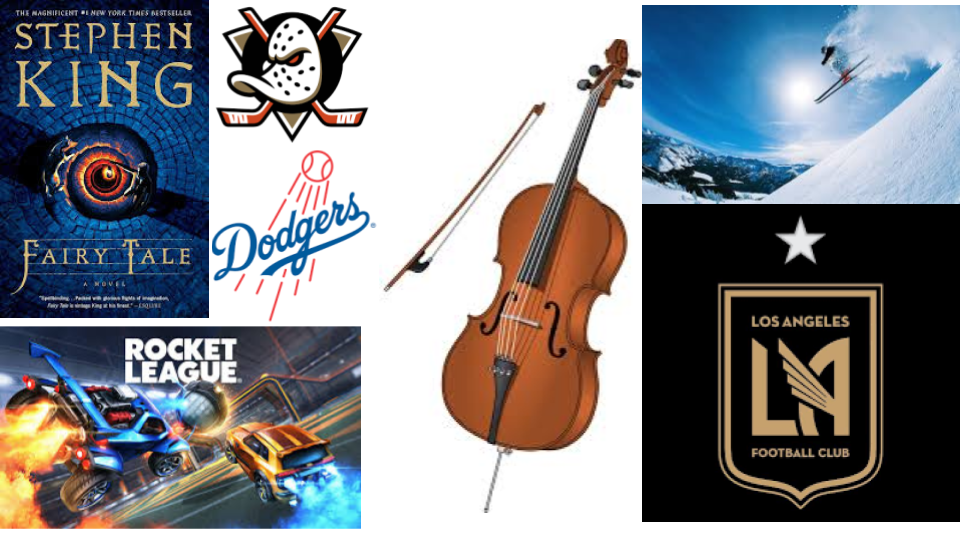

# Me In Markdown
## Introduction
Hello! My name is Nate. I play the cello, play a few video games, and do  anything that's fun. I like ice cream, ramen, and really all types of food. For fun, I practice my instrument, read, or do whatever I feel like doing.

Over the summer, I didn't do much besides summer school. I mostly caught up on sleep and prepared for the year. I did break my arm at the end of my summer, so I spent the rest of it in a cast. My goal for the year is to get 5's on all my AP tests, so I'm going to have to work hard in April. I hope to learn better work habits and study skills this year.

One of my favorite things to do is practice my instrument, the cello. Right now, I am a part of a city youth orchestra. I hope to continue it in college, but I'll see how things go in a few years. Spending time playing Rocket League comes in a close second. I haven't played as much recently, with the end of the summer and all the new work. For food, I don't really have a favorite. If I had to pick one, it would most likely be an Asian stew or noodle soup. I'm not picky, though; I'll eat whatever when I'm hungry. All this being said, I hope to start off the year strong.

## My Spotify Playlist
I don't really listen to music, but here are a few songs I like.

[My Playlist](https://open.spotify.com/playlist/56yNmUhaXVi9z7yIgulqz9?si=6e268d641fa6415a)

## Image Collage
